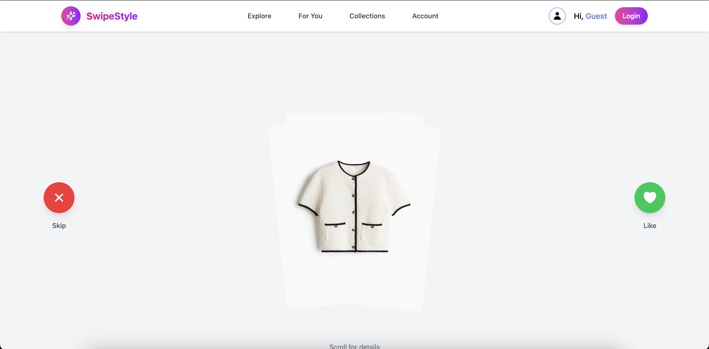

# SwipeStyle 👗✨

*Tinder for Clothes - Discover your perfect style with AI-powered recommendations*

## What is SwipeStyle?

SwipeStyle is a web app that revolutionizes how you discover fashion. Swipe right on clothes you love, build your style profile, and get personalized recommendations powered by AI. Think Tinder, but for building your dream wardrobe.

## 📱 App Visuals

### 1. Explore Page (Landing)

Experience the clean, modern interface that welcomes new users to SwipeStyle.

#### Screenshots

*Clean landing page with call-to-action and feature highlights*

### 2. Login & Registration

Seamless authentication experience with Google OAuth integration.

#### Screenshots

*Modern login interface with social authentication*


*Step-by-step registration process with style preferences*

### 3. Account Pages

Comprehensive user profile management and settings interface.

#### Screenshots

*Personal profile with style statistics and preferences*

### 4. Explore Page (After Login)

Personalized discovery experience with AI-powered recommendations.

#### Screenshots

*AI-curated fashion feed based on user preferences*


*Detailed product view with purchase options*

#### Demo Video
https://github.com/user-attachments/assets/107ae591-3526-4b80-bd5a-1dbc5375fae3

### 5. Collections

Organize and manage your favorite fashion finds.

#### Demo Videos
https://github.com/user-attachments/assets/39a5a021-c61b-446a-ae19-fc25cedf46b5

*Video: Creating and managing collections*

### 6. For You Page

Discover trending styles and personalized recommendations.

#### Demo Videos

https://github.com/user-attachments/assets/89d401b4-1b85-4565-925c-d45a28f60fc5

*Video: Personalized recommendations and style discovery*

## ✨ Key Features

### 🔥 Smart Discovery

* **Swipe Interface**: Intuitive left/right swiping to discover new pieces
* **AI-Powered Matching**: Machine learning analyzes your preferences to surface perfect matches
* **Visual-First Design**: High-quality images with smooth animations and transitions

### 🎯 Personalized Experience

* **Style Profiling**: AI learns your taste from swipes (casual vs formal, colors, patterns, materials)
* **Smart Recommendations**: Algorithm improves with every interaction
* **Preference Categories**: Color palettes, style aesthetics, occasions, and more

### 💫 Organization Tools

* **Wishlist**: Save items you love for later purchase
* **Outfit Builder**: Mix and match pieces to create complete looks
* **Style Analytics**: Track your fashion preferences over time

## 🛠 Tech Stack

**Frontend**: React + Tailwind CSS
**Backend**: Spring Boot + PostgreSQL
**AI/ML Service**: FastAPI + Python (Sentence Transformers)
**Authentication**: Google OAuth
**Deployment**: Docker containerized

## 🏗 Architecture Overview

```
┌─────────────────────┐    ┌──────────────────────┐    ┌──────────────────────┐    ┌─────────────────────┐
│   React App     │    │   Spring Boot    │    │   FastAPI       │    │   PostgreSQL    │
│                 │    │                  │    │   (Python)      │    │                 │
│ • Swipe UI      │◄──▶│ • REST APIs      │◄──▶│ • ML Models     │    │ • User Data     │
│ • Auth          │    │ • Google OAuth   │    │ • Embeddings    │◄──▶│ • Clothing DB   │
│ • Preferences   │    │ • Data Layer     │    │ • Classification│    │ • Preferences   │
└────────────────────┘    └─────────────────────┘    └─────────────────────┘    └────────────────────┘
```

## 🚀 Getting Started

### Prerequisites

Before running SwipeStyle, ensure you have the following installed:

* **Java 17+** (for Spring Boot backend)
* **Node.js 16+** and **npm** (for React frontend)
* **Python 3.8+** and **pip** (for AI/ML service)
* **PostgreSQL 13+** (database)
* **Git** (for cloning the repository)

### 1. Clone the Repository

```bash
git clone https://github.com/harshilarora2005/SwipeStyle.git
cd SwipeStyle
```

### 2. Database Setup

First, create the PostgreSQL database:

```sql
psql -U postgres
CREATE DATABASE swipestyle;
CREATE USER swipestyle_user WITH PASSWORD 'your_password';
GRANT ALL PRIVILEGES ON DATABASE swipestyle TO swipestyle_user;
\q
```

### 3. Backend Setup

```bash
cd swipestylebackend
cp .env.example .env
```

Update `.env`:

```env
DATABASE_URL=jdbc:postgresql://localhost:5432/swipestyle
DATABASE_USERNAME=swipestyle_user
DATABASE_PASSWORD=your_password
GOOGLE_CLIENT_ID=your-google-client-id.apps.googleusercontent.com
GOOGLE_CLIENT_SECRET=your-google-client-secret
```

### 4. Google OAuth Setup

1. Go to the [Google Cloud Console](https://console.cloud.google.com/)
2. Create a new project or select existing one
3. Enable the Google+ API
4. Go to Credentials → Create Credentials → OAuth 2.0 Client IDs
5. Set application type to Web application
6. Add redirect URIs:

   * `http://localhost:8080/oauth2/callback/google`
   * `http://localhost:3000/auth/callback`
7. Paste the Client ID and Secret into `.env`

### 5. Frontend Setup

```bash
cd ../swipestylefrontend
cp .env.example .env
```

Update `.env`:

```env
VITE_GEMINI_API_KEY=your_google_gemini_api_key
```

### 6. Create a Gemini API Key

1. Go to [Google AI Studio](https://makersuite.google.com/app/apikey)
2. Sign in with your Google account
3. Generate a new API key
4. Paste the key into the `.env` file for the frontend:

```env
VITE_GEMINI_API_KEY=your_api_key_here
```

### 7. Python AI Server Setup

```bash
cd ../PythonServer
python -m venv venv
source venv/bin/activate
pip install -r requirements.txt
```

To start the server:

```bash
python embedding_server.py
```

The server runs on `http://localhost:8000`

### 8. Run the Full Stack App

Make sure all services are running:

```bash

# Start Python server
cd PythonServer
python embedding_server.py

# Start Backend
cd ../swipestylebackend
./mvnw clean install
./mvnw spring-boot:run


export $(cat .env | xargs)  
java -jar target/swipestylebackend.jar

# Start Frontend
cd ../swipestylefrontend
npm install
npm start
```

## 📊 Environment Variables Reference

### Backend

| Variable               | Description         |
| ---------------------- | ------------------- |
| `DATABASE_URL`         | PostgreSQL JDBC URL |
| `DATABASE_USERNAME`    | DB username         |
| `DATABASE_PASSWORD`    | DB password         |
| `GOOGLE_CLIENT_ID`     | Google OAuth ID     |
| `GOOGLE_CLIENT_SECRET` | Google OAuth Secret |

### Frontend

| Variable              | Description    |
| --------------------- | -------------- |
| `VITE_GEMINI_API_KEY` | Gemini API Key |


## 🚀 Future Enhancements

* More websites support, social features, seasonal styles, deal alerts


## 🔗 Links

**Docs**: [docs.swipestyle.app](https://docs.swipestyle.app)
**API Docs**: [GitHub Pages](https://harshilarora2005.github.io/SwipeStyle/)

